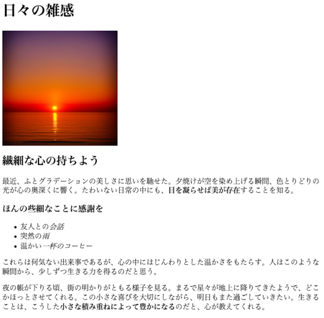

# fern-parser


A parser combinator written in TypeScript.


## Usage

See ./tests/.

And see also the Playground: 
- https://mindboard.github.io/fern-parser-playground/


## Example

see ./examples/.





Source:

```plaintext
# 日々の雑感


## 繊細な心の持ちよう

最近、ふとグラデーションの美しさに思いを馳せた。
夕焼けが空を染め上げる瞬間、色とりどりの光が心の奥深くに響く。
たわいない日常の中にも、**目を凝らせば美が存在**することを知る。

### ほんの些細なことに感謝を

- 友人との*会話*
- 突然の*雨*
- 温かい*一杯のコーヒー*

これらは何気ない出来事であるが、心の中にはじんわりとした温かさをもたらす。
人はこのような瞬間から、少しずつ生きる力を得るのだと思う。

夜の帳が下りる頃、街の明かりがともる様子を見る。
まるで星々が地上に降りてきたようで、どこかほっとさせてくれる。
この小さな喜びを大切にしながら、明日もまた過ごしていきたい。
生きることは、こうした**小さな積み重ねによって豊かになる**のだと、心が教えてくれる。
```

Result:

```html
<h1>日々の雑感</h1>
<div></div>
<h2>繊細な心の持ちよう</h2>
<p>最近、ふとグラデーションの美しさに思いを馳せた。
夕焼けが空を染め上げる瞬間、色とりどりの光が心の奥深くに響く。
たわいない日常の中にも、<b>目を凝らせば美が存在</b>することを知る。</p>
<h3>ほんの些細なことに感謝を</h3>
<ul><li>友人との<i>会話</i></li>
<li>突然の<i>雨</i></li>
<li>温かい<i>一杯のコーヒー</i></li></ul>
<p>これらは何気ない出来事であるが、心の中にはじんわりとした温かさをもたらす。
人はこのような瞬間から、少しずつ生きる力を得るのだと思う。</p>
<p>夜の帳が下りる頃、街の明かりがともる様子を見る。
まるで星々が地上に降りてきたようで、どこかほっとさせてくれる。
この小さな喜びを大切にしながら、明日もまた過ごしていきたい。
生きることは、こうした<b>小さな積み重ねによって豊かになる</b>のだと、心が教えてくれる。 </p>
```
